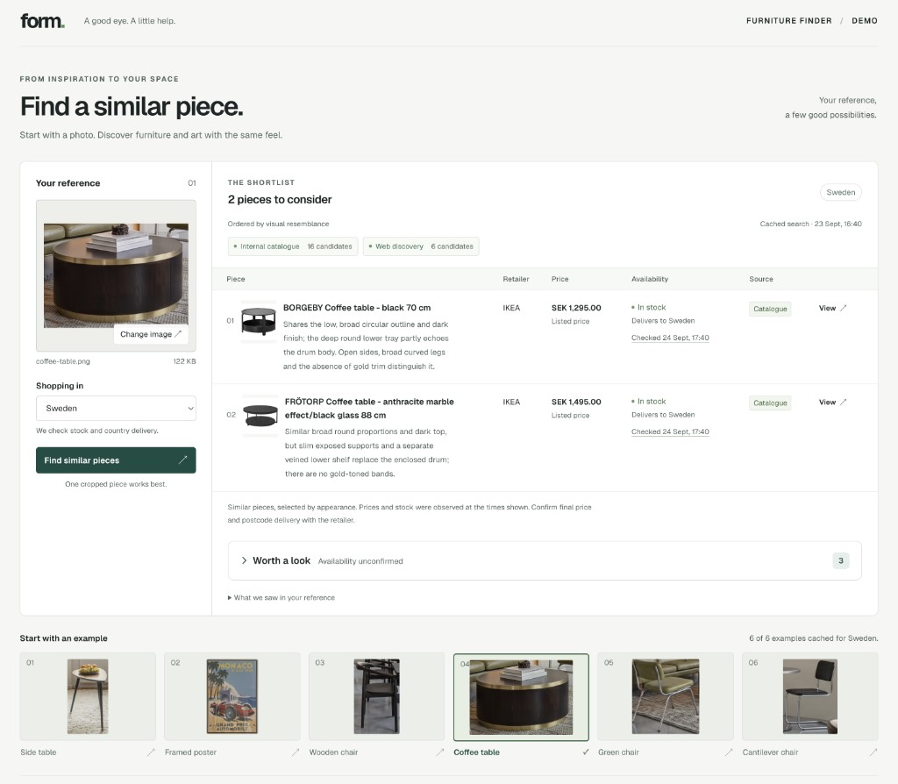
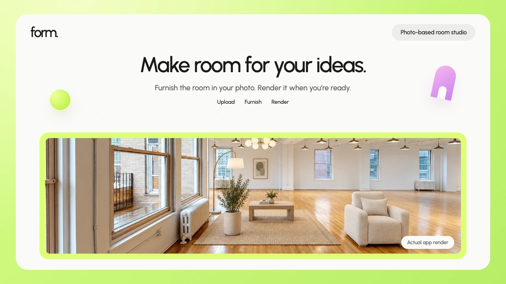

# Form. Furniture matching demo

A local Next.js application: upload one cropped image, choose Sweden, Germany or the UK, and compare up to five visually similar products with current country purchase evidence. The six reference crops from the supplied PDF are included as sample inputs.



## Current state

The application, Supabase migration, catalogue preparation/import scripts, source retrieval, image ranking, caching and interface are implemented. The prepared catalogue contains **31 real IKEA variants and 81 country offers**, fetched on 23 September 2026. The catalogue deliberately includes near alternatives and a few distractors. It is not an exact-identification dataset.

**Live OpenAI matching and managed Supabase are connected and tested.** The migration and catalogue import are complete in the configured project. Real browser searches have returned catalogue and web products, with unconfirmed offers kept separate. No synthetic results are used by the application. See `docs/validation.md` for measured latency, individual outcomes and remaining limits.

## Portfolio preview

The photo-based room-studio prototype has a **Sunbeam-inspired portfolio pack** with Urbanist typography, lime framing, real UI screenshots and an actual AI-generated room image. This documentation update publishes the preview and handoff assets; the room-editor implementation is separate local work.

[](docs/portfolio/form/README.md)

**[Browse the preview and image library](docs/portfolio/form/README.md)** · [Case-study copy](docs/portfolio/form/CASE-STUDY.md) · [Implementation prompt](docs/portfolio/form/START-HERE.md) · [Download the pack](docs/portfolio/form/form-portfolio-pack.zip)

## Set up

Requires Node.js 22+ and npm. Run commands from this folder.

1. Install dependencies with `npm ci`. Copy `.env.example` to `.env.local` **only if `.env.local` does not already exist**. Fill in:

   ```dotenv
   OPENAI_API_KEY=your-openai-api-key
   SUPABASE_URL=https://your-project.supabase.co
   SUPABASE_SECRET_KEY=your-server-side-supabase-secret-key
   OPENAI_MODEL=gpt-6-astra
   ```

   `SUPABASE_SERVICE_ROLE_KEY` is also accepted for projects using legacy service-role keys. Never use an anon/publishable key here. These values stay server-side; do not prefix them with `NEXT_PUBLIC_`. The OpenAI project needs billing and access to the configured model, web search and `text-embedding-3-small`. `npm run setup:check` checks model access, not generation/tool compatibility. The requested model is configurable; no silent model substitution occurs.

2. Create a managed Supabase project. Paste **`supabase/migrations/202609230001_furniture_demo.sql`** into its SQL editor and run it. It creates only `furniture_*` tables, a restricted vector-search function, and the private `furniture-images` bucket. Application tables have RLS enabled; only the server service key accesses them. There are no user accounts or public storage policies.

3. Run `npm run catalogue:prepare` to refresh the hand-selected retailer pages and download product images. Then run `npm run catalogue:import`. Import uploads the images to private storage, generates visual descriptions and 1536-dimensional text embeddings, and writes country offers with their source evidence. Import makes paid OpenAI calls. It processes two variants at a time and reuses descriptions already imported for the same image/model. If a retailer page disappears, preparation skips it, saves the successful records, and exits nonzero with a list of failures. Inspect that list before continuing. This is a bounded import, not a crawler.

4. Run `npm run setup:check`. Resolve any missing schema/bucket/model access and confirm nonzero variants. Then run `npm run dev` and open **http://127.0.0.1:3000**. Restart after changing `.env.local`.

5. Select the wooden chair, side table, coffee table, green chair and cantilever chair samples, one at a time. Run a search for each. Inspect actual photos, purchase URLs, prices and evidence. Change to Germany or the UK and search again. Repeat an unchanged search to check the cache label. Try the poster too; its visual specificity and sparse catalogue coverage make it a harder case.

For a production build running locally: `npm run build`, then `npm start`. There is no deployment configuration.
