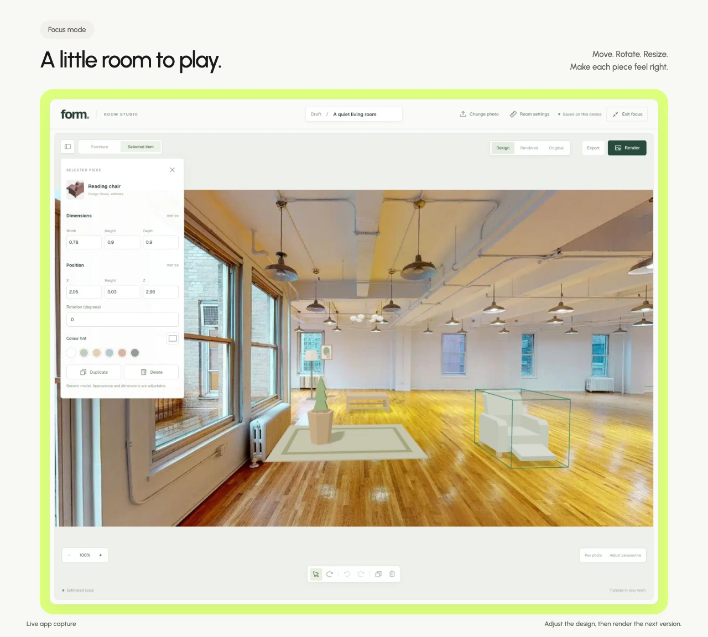

# Form

**Make room for your ideas.**

Form is a room studio for trying furniture ideas in the space you already have. I designed and built a photo-based workspace around a simple flow: upload, furnish, render. Furniture stays editable over the original photograph, while an on-demand AI render turns the arrangement into a finished image.

## The idea

It is hard to picture a new room from separate product photos. Form brings those ideas into a photograph of your own space. Early iterations used a separate 3D room and a detailed setup panel. I simplified the experience so people can start placing pieces straight away, with measurements and perspective adjustments available when needed. The original photo stays close at hand, making it easy to compare the room you have with the room you are imagining.

## The workspace

A furniture library sits beside the photo, with seating, tables, rugs, lighting, art and curtains. Each piece can be moved, rotated, resized, recoloured, duplicated or removed, with undo and redo for revisions. Focus mode gives the room more space and keeps the controls close. Design, Rendered and Original separate the editable layout from the finished image. When the arrangement feels right, Render creates a new still; JPEG, PNG, WebP and PDF exports make it easy to keep or share.

## How it’s built

Next.js, React and TypeScript power the workspace. Three.js, React Three Fiber and Drei keep furniture in perspective over the photograph. OpenAI handles photo analysis and on-demand image generation; IndexedDB saves the active draft, original photo and latest render in the browser. Product imports label generic substitutes when an exact model is unavailable. Export runs locally, with pdf-lib for PDF output. Regression tests cover placement, history, persistence and export. This is a working prototype; cloud projects and purchasing are future work.

## Project details

- Role: product design and full-stack development.
- Status: working prototype.
- Focus: photo-based furnishing, editable furniture, on-demand rendering and export.
- Presentation: Urbanist, lime accents and rounded white panels, inspired by Sunbeam. The live app retains its current styling.
- No adoption or business-impact metrics have been established.
