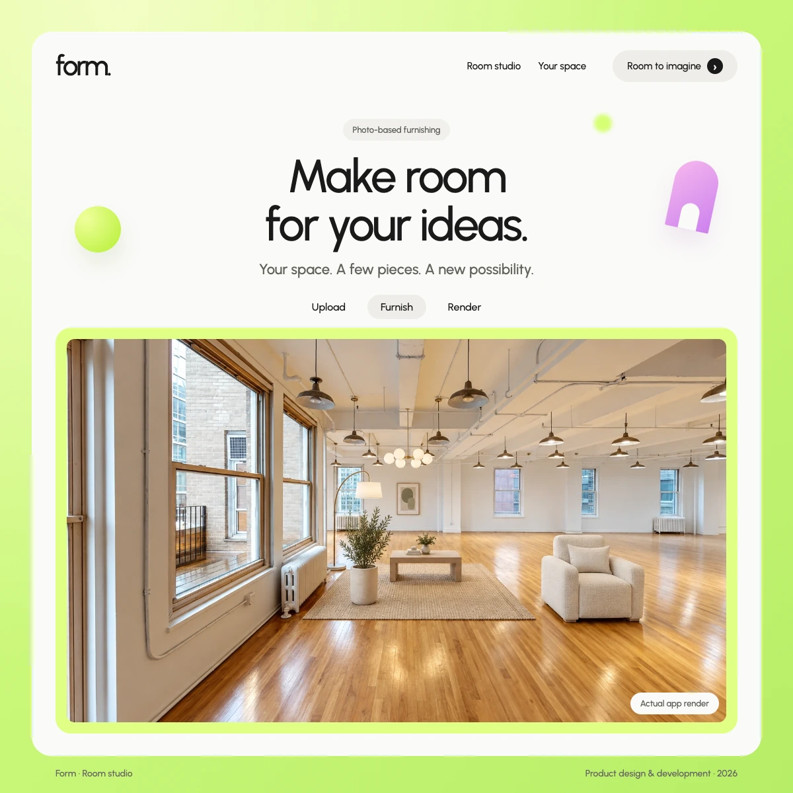
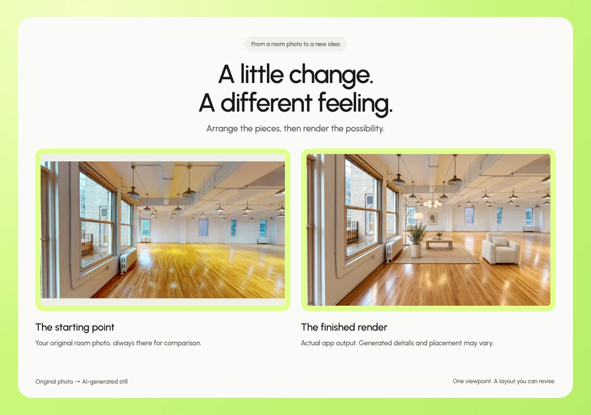
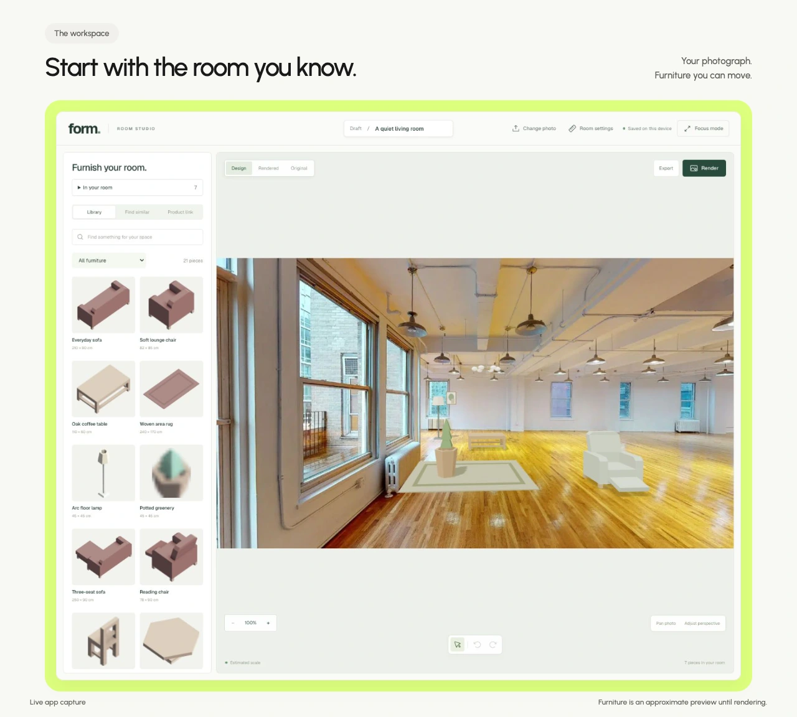
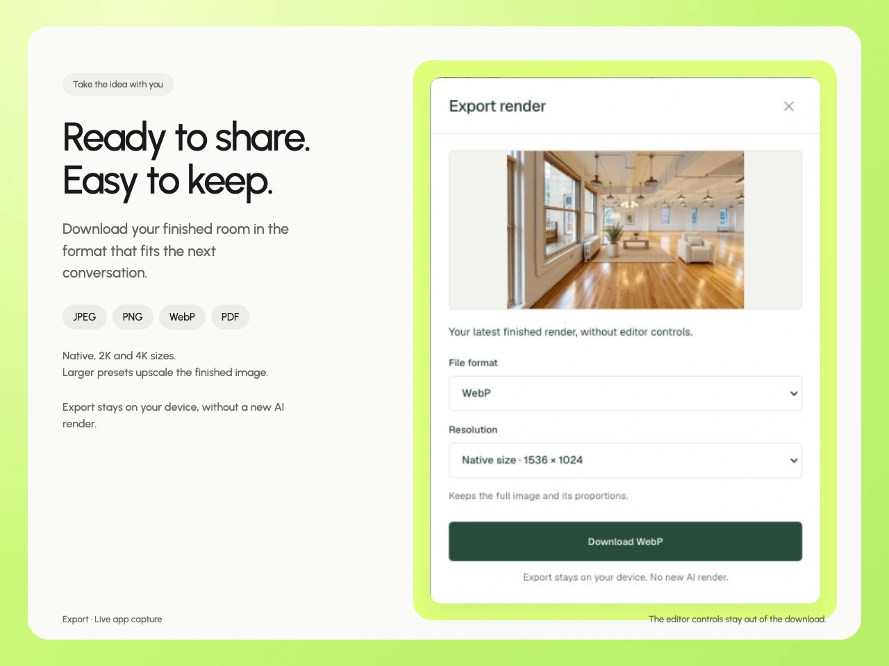

# Form portfolio preview

**Urbanist, lime framing and real product captures**, prepared for a new Form grid tile and an Akkivo-style case study.

[Implementation prompt](IMPLEMENTATION-PROMPT.md) · [Case-study copy](CASE-STUDY.md) · [Content module](content/form.ts) · [Download the complete pack](form-portfolio-pack.zip)


## Square portfolio banner

The grid cover matches the Akkivo reference: **1200 × 1200 px (1:1)**. Use WebP for the portfolio, or PNG when a lossless image is preferred. The composition was reflowed for a square without stretching the room image.

[](assets/form-thumbnail.png)

## Review the preview

The images below render directly in GitHub. For the interactive image library, download the pack and open `index.html`, or run this from the repository root:

```sh
python3 -m http.server 3047 --bind 127.0.0.1 --directory docs/portfolio/form
```

Open **http://127.0.0.1:3047/**. The preview switches between Original, Design and Rendered captures, filters the image library, and links to the repository. It does not run the editor or make AI requests.

## Image library

The pack includes **13 WebP images**, plus a PNG version of the square grid cover. Use the six core images for one grid tile and one case study; the remaining seven are supporting alternatives. [The manifest](ASSET-MANIFEST.json) includes dimensions, captions and alt text.

| Placement | Image |
| --- | --- |
| Portfolio grid · 1200 × 1200 | [WebP](assets/form-thumbnail.webp) · [PNG](assets/form-thumbnail.png) |
| Case-study hero | [Hero](assets/form-hero.webp) |
| Lead image | [Design workspace](assets/form-workspace.webp) |
| The idea | [Original and rendered comparison](assets/form-before-after.webp) |
| The workspace | [Focus-mode editing](assets/form-focus.webp) |
| How it’s built | [Download and export](assets/form-export.webp) |



<details>
<summary>See the editable workspace and export</summary>





</details>

## Add it to the portfolio

1. Use [START-HERE.md](START-HERE.md) for a short prompt, or [IMPLEMENTATION-PROMPT.md](IMPLEMENTATION-PROMPT.md) for the full handoff.
2. Copy `content/form.ts` into the portfolio content folder and all 13 images into its `public/assets/` folder.
3. Register Form in the existing case-study and gallery registries, immediately after Akkivo. Reuse the existing components. No new UI library is needed.

The visual direction follows [Sunbeam](https://sunbeam.framer.media/) and uses [Urbanist](https://fonts.google.com/specimen/Urbanist). [Design tokens and scope](DESIGN-SYSTEM.md) are included. The style applies to the presentation and preview only; actual app screenshots retain their original interface.

## Scope and sources

This update publishes **documentation, preview files and portfolio assets**. The photographed room-studio implementation is separate local work and is not shipped by this documentation branch. The portfolio itself has not been changed.

The furnished image is an actual successful Form AI render. Generated placement and details may vary. The original room photo comes from the existing user draft; its external source and publication licence were not recorded. See [source notes](SOURCE-NOTES.md), the [Urbanist licence](source/URBANIST-LICENSE.txt), and [verification notes](VERIFICATION.md).
